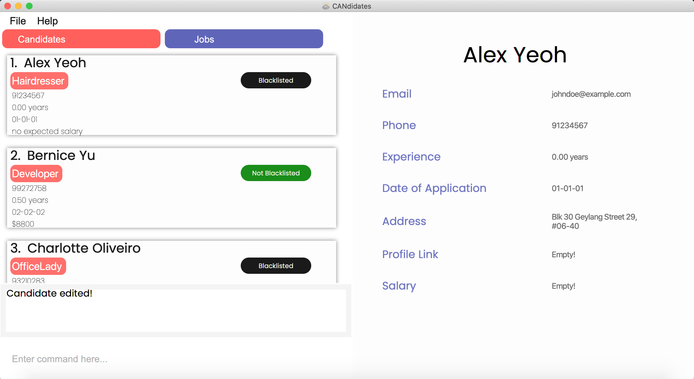
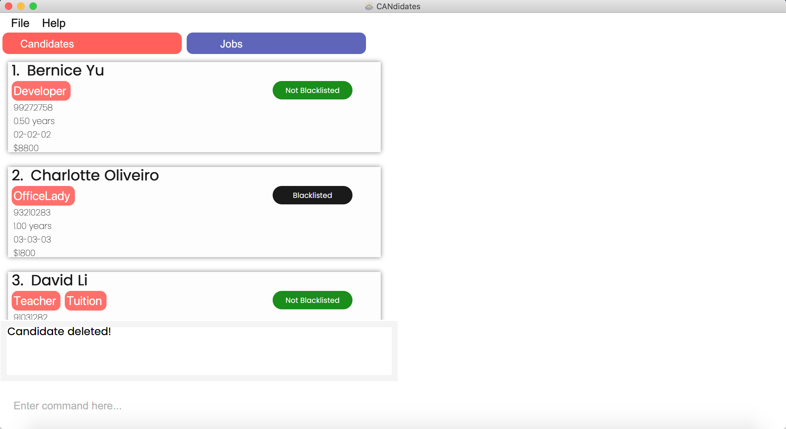
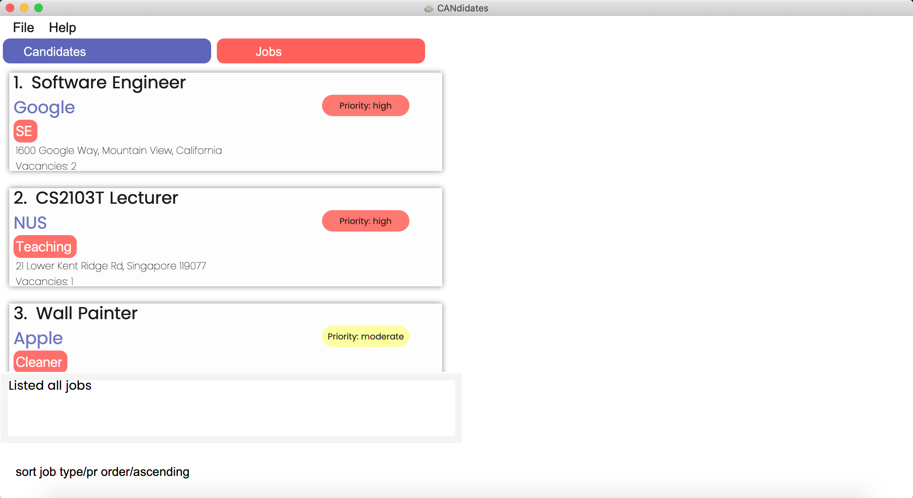
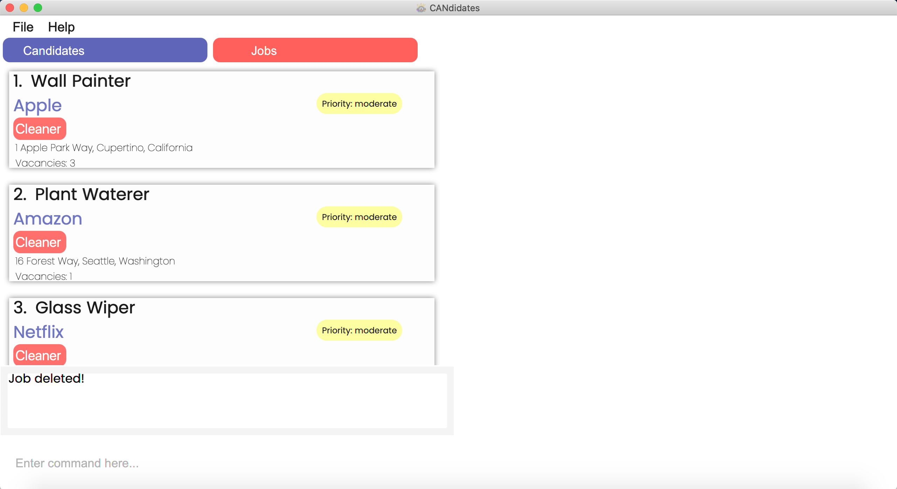
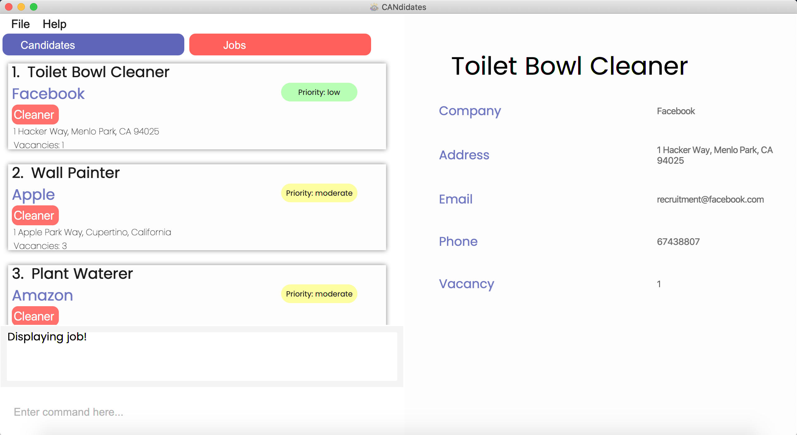

* Table of Contents
{:toc}

--------------------------------------------------------------------------------------------------------------------

## **1. Introduction**
Hello there! If you are reading this, you must be curious about *CANdidates*. 

*CANdidates* is a powerful and optimized contact management app for job recruiters to manage job candidates and job listings. 
A key strength of *CANdidates* is its convenience and ease of managing all job-related contacts in a single application. 
Additionally, it is an offline application that does not require an internet connection to function. No need to worry about
disconnecting from the internet anymore!

If you find yourself having difficulty in managing job candidates and positions, then *CANdidates* is the perfect tool for you! 
Use this user guide to discover the amazing functions and features of *CANdidates*! 
Although *CANdidates* is simple and intuitive enough to use without having to read this user guide, 
we still recommend that you read through in order to fully utilise *CANdidates*. 

Before you get thrown off by some of the more technical terms used in this user guide, 
you may be happy to know that a [glossary](#9-glossary) is provided at the end of this document and may be of help to you!

### 1.1 Authors
*CANdidates* is developed as part of a NUS CS2103T Project by:

* [Amelia Tan Jin Yu](team/ameliatjy.md) (Contributed Sections [4.4](#44-finding-a-candidate-find-can) and [5.4](#54-finding-a-job-find-job))
* [Lee Joon Jie](team/breadpeanutbutter.md) (Contributed Sections [4.3](#43-editing-a-candidate-edit-can), [4.6](#46-deleting-a-candidate-delete-can), [4.8](#48-clearing-all-candidate-entries-clear-can), [5.3](#53-editing-a-job-edit-job), [5.6](#56-deleting-a-job-delete-job) and [5.8](#58-clearing-all-job-entries-clear-job))
* [Nigel Ng Yong Sheng](team/vangoghhh.md) (Contributed Sections [4.5](#45-sorting-all-candidates-sort-can), [4.7](#47-viewing-a-candidate-view-can) and [5.7](#57-viewing-a-job-view-job))
* [Tan Yu Ting, Germaine](team/g-erm.md) (Contributed Section [5.5](#55-sorting-all-jobs-sort-job))
* [Toh Hong Xian](team/raythx98.md) (Contributed Sections [4.1](#41-adding-a-candidate-add-can), [4.2](#42-listing-all-candidates-list-can), [5.1](#51-adding-a-job-add-job), [5.2](#52-listing-all-jobs-list-job) and [6.1](#61-viewing-help-help))

 

--------------------------------------------------------------------------------------------------------------------

## **2. Preface**
For a smoother start to your usage of *CANdidates*, read this section to find out how this document is structured, 
how to navigate the document and what all the symbols, special fonts and command formats mean.

### 2.1 Understanding this Document
This User Guide is structured into 9 sections so that it is easy to read and navigate!  
These are the 9 sections and a short explanation of what they are for:

   Section Title                                                    | What is it for
------------------------------------------------------------|------------------------------------
[1. Introduction](#1-introduction)                          | An introduction to *CANdidates* and the amazing team behind it! 
[2. Preface](#2-preface)                                    | A warm-up to get you familiar with this document. This is the section you are reading now. 
[3. Quick Start](#3-quick-start)                            | A quick guide to start using *CANdidates* for those of you who are very eager to begin using our application! 
[4. Features for Candidates](#4-features-for-candidates)    | An exhaustive list of commands to manage your list of candidates. Learn about the command formats, view examples and step-by-step instructions here.
[5. Features for Jobs](#5-features-for-jobs)                | An exhaustive list of commands to manage your job listings. Learn about the command formats, view examples and step-by-step instructions here.
[6. Other Features](#6-other-features)                      | A list of general features not specific to candidates or job listings.
[7. FAQ](#7-faq)                                            | Frequently Asked Questions that we receive. Take a look here if you have any lingering questions to see if they have been answered.
[8. Command Summary](#8-command-summary)                    | A table that summarises the commands and their respective formats. This is convenient as a quick reference for commands.
[9. Glossary](#9-glossary)                                  | An explanation of certain specialised terms used in this document.

### 2.2 Understanding Symbols
This section explains all the symbols and fonts used in this document.

Symbols/Font   | Explanation
---------------|------------------------------------
`command`      | Words that are highlighted in grey indicate that the words are describing a typed command. It could be a command format, a full command or part of a command.
:black_nib:    | An example of how to use the feature.
:memo:         | Additional comments on the section or sub-section being explained.
:bulb:         | Useful tips that you can keep in mind when exploring the application or this document.
:exclamation:  | Precautions you should take note of when using the application.

### 2.3 Understanding the CANdidates GUI
The figure below shows an annotated version of the GUI, to help you in understanding some of the technical terms used regarding our GUI.  
You may refer back to this section whenever you need help understanding the GUI terms.

:memo: *In the Tab Buttons, the tab you are currently on is marked as red. i.e. "Jobs" button is in red as the list currently shows the list of jobs.*
 
:bulb: *The display panel is scrollable! Keep this tip in mind so that you do not miss out on any information!*

### 2.4 Understanding Input Fields
To kickstart this subsection, let us understand what exactly are input fields? Input fields are fields that you specify in your commands to tell *CANdidates* exactly what you wish to do, such as the
information to store. Most input fields have specific requirements that have to be fulfilled or *CANdidates* will not be able to 
understand you! 
 
The table below provides a summary of the requirements, but do not worry if you cannot
remember them because *CANdidates* will notify you with an error message if any of these requirements 
are not met, and you can then make the relevant changes!

If you feel unsure while exploring this section due to the lack of prior context, fret not! You will certainly understand
better when you read about the commands in the later sections. Try taking a quick glance at the command formats
in [Section 4. Features for Candidates](#4-features-for-candidates)  or [Section 5. Features for Jobs](#5-features-for-jobs)!

You may refer to this table whenever you need help understanding the input fields.

Name of input field   | How to use them
----------------------|------------------------------------
`NAME`                | Name of candidate.
`PHONE_NUMBER`        | Contact number of candidate or job listing.
`EMAIL`               | Contact email address of candidate or job listing.
`ADDRESS`             | Residential address of a candidate or work address of a job listing.
`YEARS_OF_EXPERIENCE` | Years of experience of the candidate in the relevant job he/she applied for.
`DATE_OF_APPLICATION` | Date of application submitted by candidate. :memo: *Date should be in the format of DD-MM-YY* :black_nib: *If the date of application is 31 September 2021, input* `doa/31-09-21`
`EXPECTED_SALARY`     | Expected salary of a candidate in dollars. :memo: *This field accepts only whole numbers.* :bulb: *Have an expected salary in cents? Round up to the nearest whole number!*
`IS_BLACKLISTED`      | Blacklist status of a candidate. You may use this to blacklist candidates that are unresponsive, have poor attitude, etc.
`PROFILE_LINK`        | URL link to candidate profile or portfolio (e.g. LinkedIn or GitHub, etc.) to provide convenience for you to refer to their profile later on.
`JOB_TYPE`            | Job type tags for candidates so that it will be easier to find candidates applying for similar jobs. For example, you can tag them according to the job industry.
`JOB_TITLE`           | Title of a job position.
`COMPANY_NAME`        | Name of the company posting the job listing.
`VACANCY`             | Vacancy of a job listing i.e. Number of available slots open for hiring.
`PRIORITY`            | Priority of a job listing. Job listings may be of different urgency levels and this field is used to indicate the urgency. :memo: *You can indicate the priority as low, moderate or high!*
`JOB_DESCRIPTION`     | Job description tags for job listings to specify additional descriptions. For example, you can specify requirements of the job such as age or skill level.
`FIELD_TO_SORT`       | Input field that is exclusive for [sort can](#45-sorting-all-candidates-sort-can) and [sort job](#55-sorting-all-jobs-sort-job) commands, to specify the field that the candidate or job list is sorted by.
`ORDER`               | Input field that is exclusive for [sort can](#45-sorting-all-candidates-sort-can) and [sort job](#55-sorting-all-jobs-sort-job) commands, to specify the sort order. :memo: *You can indicate it as ascending or descending!*
`INDEX`               | Index number of the candidate or job displayed in the list.

### 2.5 Understanding Command Format

This section explains how to interpret all the command formats which you will encounter in [Section 4. Features for Candidates](#4-features-for-candidates), [Section 5. Features for Jobs](#5-features-for-jobs) and [Section 6. Other Features](#6-other-features).
This will help you to understand *CANdidates*' features better!

* Command formats are highlighted in grey as mentioned in [Section 2.2. Understanding Symbols](#22-understanding-symbols)

* Words in `UPPER_CASE` are the input fields which are supposed to be specified by you!  
  e.g. in `add n/NAME`, `NAME` is a input field which can be used as `add n/John Doe`.

* Items in square brackets are optional; this means less typing! 
  e.g `c/COMPANY_NAME [t/JOB_DESCRIPTION]` can be used as `c/Samsung t/ContractWorker` or just `c/Samsung`.

* Items with `…` after them can be used multiple times. This means that you can put as much information as you want to! 
  e.g. `[t/JOB_TYPE]…` can be used as `t/accountant` (i.e. 1 time), `t/programmer t/technician` (i.e. 2 times) etc.

* Input fields can be in any order you want them to be, no need for memorising the input sequences! 
  e.g. if the command specifies `n/NAME p/PHONE_NUMBER`, `p/PHONE_NUMBER n/NAME` is also acceptable.
  
*:bulb: Need a recap of the various input fields? Refer to [Section 2.4. Understanding Input Fields](#24-understanding-input-fields)!*

 

--------------------------------------------------------------------------------------------------------------------

## **3. Quick Start**
Can’t wait to start using *CANdidates*? Us too! Let us guide you through the starting up process, so that you can proceed on to use the application for your own needs!

1. Download the latest Candidates.jar file from [here](https://github.com/AY2021S1-CS2103T-T17-3/tp/releases/tag/v.1.4).

1. Copy the file to the folder you want to use as the _home folder_ for your *CANdidates*.

1. Double-click the file to start the app. The GUI similar to the below should appear in a few seconds! Note how the app contains some sample data. 
   

1. Type some commands in the *command box* and press *Enter* to execute them! e.g. typing **`help`** and pressing *Enter* will open the help window. 
   Some other example commands you can try:

   * **`list can`** : Shows you all the candidates!

   * **`add can`**`n/John Doe p/98765432 e/johnd@example.com a/John street, block 123, #01-01 exp/5 doa/15-10-20` : 
   Adds a candidate named _John Doe_ with his particulars!

   * **`delete can`**`3` : Deletes the 3rd candidate shown in the current candidates list.

   * **`clear can`** : Deletes all candidates.

   * **`exit`** : Exits the app.

1. Refer to [Section 4. Features for Candidates](#4-features-for-candidates), [Section 5. Features for Jobs](#5-features-for-jobs) and [Section 6. Other Features](#6-other-features) more details of each command!

:exclamation: *Ensure you have Java 11 or above installed in your Computer.*
 
:bulb: *If you are confused with the various input fields, refer to* [Section 2.4. Understanding Input Fields](#24-understanding-input-fields)!

 

--------------------------------------------------------------------------------------------------------------------

## **4. Features for Candidates**
This section provides you with features to handle all information of candidates for your utmost convenience!
 
Refer to [Section 5. Features for Jobs](#5-features-for-jobs) for features specific to jobs or to [Section 6. Other Features](#6-other-features) for more general features.

 

### 4.1 Adding a candidate: `add can`

Have a new candidate looking for a job? You can easily add them into *CANdidates* using the command below!

**Format:** `add can n/NAME p/PHONE_NUMBER e/EMAIL exp/YEARS_OF_EXPERIENCE doa/DATE_OF_APPLICATION [a/ADDRESS] [sal/EXPECTED_SALARY] [bl/IS_BLACKLISTED] [link/PROFILE_LINK] [t/JOB_TYPE]…​`

:bulb: *Unsure of what to input in each field? Refer to [Section 2.4. Understanding Input Fields](#24-understanding-input-fields)!*

**Examples:**

:black_nib: To add a candidate with name _John Doe_ with his particulars,

    add can n/John Doe p/98765432 e/johnd@example.com a/John street, block 123, #01-01 
    t/DogGroomer exp/1 doa/16-10-20

:black_nib: To add a candidate with name _Betsy Crowe_ with her particulars,

    add can n/Betsy Crowe e/betsycrowe@example.com a/NUS Temasek Hall p/92920033 
    t/HR t/OfficeLady exp/5 doa/10-10-20 link/BetsyCrowe.com sal/3000
    
**Step by Step:**

Step 1. Just type `add can n/John Doe p/98765432 e/johnd@example.com a/John street, block 123, #01-01 t/DogGroomer exp/1 doa/16-10-20` in the *command box* and press *Enter*.

 

Step 2. The following message will be shown in the *result display*.
>New person added: John Doe Phone: 98765432 Email: johnd@example.com Experience: 1.0 years Date of Application: 16-10-20 Address: John street, block 123, #01-01 Link:  Expected Salary:  Blacklisted: false Tags: [DogGroomer].

 

Step 3. The new candidate will now appear in the *main list*!

### 4.2 Listing all candidates: `list can`

If you would like to see the latest changes to candidates in the application, you can refresh the list of candidates using this feature!

**Format:** `list can`

:bulb: *This command can be used after a* [`find can`](#44-finding-a-candidate-find-can) *command to show the full list of candidates again.*

 

### 4.3 Editing a candidate: `edit can`

Realised you made a mistake adding a candidate? No worries because our edit feature is here to help! Follow the instructions here to correct your mistakes!

**Format:** `edit can INDEX [n/NAME] [p/PHONE] [e/EMAIL] [exp/YEARS_OF_EXPERIENCE] [doa/DATE_OF_APPLICATION] [a/ADDRESS] [sal/EXPECTED_SALARY] [bl/IS_BLACKLISTED] [link/PROFILE_LINK] [t/JOB_TYPE]…`

:memo: *Existing values will be updated to the input values.*

**Examples:**

:black_nib: To edit the 1st candidate’s phone number, email and blacklist status to be _91234567_, _johndoe@example.com_ and _true_ respectively,

    edit can 1 p/91234567 e/johndoe@example.com bl/true

:black_nib: To edit the 2nd candidate and clear existing job types, address, expected salary and profile link,

    edit can 2 t/tailor a/Blk 405 Pasir Ris Drive 6 link/breadpeanutbutter.com

**Step by Step:**

Step 1. Simply type `edit can 1 p/91234567 e/johndoe@example.com bl/true` in the *command box* and press *Enter*.

 

Step 2. The *result display* will show:
>Candidate edited!

 

Step 3. Now the details are updated! Click on the candidate to view the candidate's new information in detail!

### 4.4 Finding a candidate: `find can`

Too many candidates with different information? *CANdidates* provide you with a simple and quick way for you to find 
candidates from the long list. All you have to do is tell *CANdidates* the keyword(s) you are looking for!

**Format:** `find can [n/NAME] [p/PHONE_NUMBER] [e/EMAIL] [exp/YEARS_OF_EXPERIENCE] [doa/DATE_OF_APPLICATION] [a/ADDRESS] [sal/EXPECTED_SALARY] [bl/IS_BLACKLISTED] [link/PROFILE_LINK] [t/JOB_TYPE]…`

:memo: *The search is case insensitive, e.g. john will match John*
 
:memo: *The order of the keywords does not matter, e.g. Doe John will match John Doe*
 
:memo: If you input multiple keywords for the tag field, candidates who have tags containing all the keywords will be displayed, e.g. `find can t/teacher tuition` will show a list of candidates with both the tags "teacher" and "tuition"

**Examples:**

:black_nib: To find candidates with name containing the keyword “grace” and an expected salary of _$4000_,

    find can n/grace sal/4000

:black_nib: To find candidates who live in Pasir Ris,

    find can a/Pasir Ris

**Step by Step:**

Step 1. Just type `find can n/David t/Teacher` in the *command box* and press *Enter*,

Step 2. The following message will be shown in the *result display*:
>1 candidate listed!

 

Step 3. All candidates with information containing the keywords will now be displayed!

### 4.5 Sorting all candidates: `sort can`

You can view all the candidates in the order you wish to by typing in your desired order. Upon execution of the command, the sorted list of candidates would be displayed on the app!

**Format:** `sort can type/FIELD_TO_SORT order/ORDER`

:memo: *The type input must be one of* `type/n`, `type/exp`, `type/sal`, `type/bl` *or* `type/doa` *depending on whether you wish to sort the candidates by their name, experience, expected salary, blacklist status or data of application respectively.*
 
:memo: *The order input must be specified as either* `order/ascending` *or* `order/descending`.
 

**Examples:**

:black_nib: To sort the list of candidates starting from the lowest number of years of experience,

    sort can type/exp order/ascending

:black_nib: To sort the list of candidates starting from the most recent application date,

    sort can type/doa order/descending

:black_nib: To view all blacklisted candidates followed by non-blacklisted candidates,

    sort can type/bl order/descending
    
**Step by Step:**

Step 1. Type `sort can type/exp order/ascending` in the *command box* and press *Enter*.

Step 2. The *CANdidates* application will show the following message in the *result display*.
>Successfully sorted list of candidates by years of experience in ascending order.

 

Step 3. The application will show the sorted candidates list based on the sort condition given.

### 4.6 Deleting a candidate: `delete can`

Hooray! You have successfully found a job for a candidate! Now that you no longer need to keep his/her details in *CANdidates*, you can simply use this feature to delete their details!

**Format:** `delete can INDEX`

:exclamation: *The specified candidate’s data will be cleared and this action is irreversible. 
Please ensure you do not require the candidate’s data anymore before performing this command.*

**Examples:**

:black_nib: To delete the candidate at index _1_,

    delete can 1

:black_nib: To delete the candidate at index _3_,

    delete can 3
    
**Step by Step:**

Step 1. Type `delete can 1` in the *command box* and press *Enter*.

 

Step 2. The message that will be shown in the *result display* is
>Deleted candidate!

Step 3. The application will show the updated candidates list without the deleted candidate!

### 4.7 Viewing a candidate: `view can`

Want to view all the information of a particular candidate? *CANdidates* provides an easy way for you to do it! Simply utilise the command below to display all the information of a candidate on the *display panel* of the application!

**Format** `view can INDEX`

**Examples:**

:black_nib: To view the candidate at index _1_,

    view can 1

:black_nib: To view the candidate at index _3_,

    view can 3

**Step by Step:**

Step 1. Type `view can 1` in the *command box* and press *Enter*.

 

Step 2. The *CANdidates* application will show the following message in the *result display* 
>Displaying candidate!

Step 3. All the information of the specified candidate would be displayed on the *display panel*.

### 4.8 Clearing all candidate entries: `clear can`

Want to clear all the candidates in the list quickly without having to delete one by one? Simply use the command below!

**Format:** `clear can`

:exclamation: *All candidate data will be cleared and this action is irreversible. 
Please ensure you do not require the candidate list data anymore before performing this command.*
 
:bulb: *This command can be used to clear the sample data on CANdidates when you first download it.*

**Step by Step:**

Step 1. Type `clear can` in the *command box* and press *Enter*.

 

Step 2. The following message will be shown in the *result display*
>Candidate list has been cleared!

Step 3. The application will now show an empty list!

    

## **5. Features for Jobs**
This section provides you with features to handle all information of job listings for your utmost convenience!
 
Refer to [Section 4. Features for Candidates](#4-features-for-candidates) for features specific to candidates or to [Section 6. Other Features](#6-other-features) for more general features.

 
       
### 5.1 Adding a job listing: `add job`

Informed of a job opening and you would like to add it in *CANdidates*? You can add it into the list using the command below!

**Format:** `add job n/JOB_TITLE c/COMPANY_NAME p/PHONE_NUMBER e/EMAIL a/ADDRESS v/VACANCY [pr/PRIORITY] [t/JOB_DESCRIPTION]…`

:bulb: *If you're unsure of what you are supposed to input in each field, refer to [Section 2.4. Understanding Input Fields](#24-understanding-input-fields).*

**Examples:**

:black_nib: To add a job with job title _Waiter_ by the company _Amelia’s Eating House_ and all the other details,

    add job n/Waiter c/Amelia’s Eating House p/98765432 e/ameliatjy@example.com 
    a/Amelia Street, Block 123, #01-01 pr/low t/MultipleLocations v/1

:black_nib: To add a job with job title _Delivery Man_ by the company _FedEx_ and all the other details, 

    add job n/Delivery Man c/FedEx e/fedex@example.com a/Joo Koon p/93333222 
    pr/high t/delivery t/west v/10

**Step by Step:**

Step 1. Type `add job n/Waiter c/Amelia’s Eating House p/98765432 e/ameliatjy@example.com a/Amelia Street, Block 123, #01-01 pr/low t/MultipleLocations v/1` in the *command box* and press *Enter*.

 

Step 2. The *CANdidates* application will show the following message in the *result display*.
>New job added: Waiter Company: Amelia’s Eating House Phone: 98765432 Email: ameliatjy@example.com Address: Amelia Street, Block 123, #01-01 Priority: low Vacancy: 1 Tags: [MultipleLocations]

Step 3. The application will now show the newly added job in the *main list*!

### 5.2 Listing all jobs: `list job`

If you would like to see the latest changes to jobs in the application, you can refresh the job listings using the format below!

**Format:** `list job`

:bulb: *This command can be used after a* [`find job`](#54-finding-a-job-find-job) *command to show the full list of job listings again.*

 

### 5.3 Editing a job: `edit job`

Made a mistake while adding a job? Edit the details of the job using the command below!

**Format:** `edit job INDEX [n/JOB_TITLE] [c/COMPANY_NAME] [p/PHONE_NUMBER] [e/EMAIL] [a/ADDRESS] [v/VACANCY] [pr/PRIORITY] [t/JOB_DESCRIPTION]…`

:memo: *Existing values will be updated to the input values.*

**Examples:**

:black_nib: To edit the 1st job’s company name, phone number, vacancy and priority to be _Dog Cafe_, _82827731_, _3_ and _high_ respectively,

    edit job 1 c/Dog Cafe p/82827731 v/3 pr/high

:black_nib: To edit the 3rd job's phone number to be _94256789_, 

    edit job 3 p/94256789

**Step by Step:**

Step 1. Type `edit job 1 c/Dog Cafe p/82827731 v/3 pr/high` in the *command box* and press *Enter*.

 

Step 2. The message that will be shown in the *result display* is
>Job edited!

 

Step 3. The application will show the updated list of jobs with the edited job. Click on the job to view the its new information in detail!

### 5.4 Finding a job: `find job`

Too many job listings with different information? You can find job listings by specifying keywords you are looking for!

**Format:** `find job [n/JOB_TITLE] [c/COMPANY_NAME] [p/PHONE_NUMBER] [e/EMAIL] [a/ADDRESS] [v/VACANCY] [pr/PRIORITY] [t/JOB_DESCRIPTION]…`

:memo: *The search is case insensitive, e.g. samsung will match Samsung*
 
:memo: *The order of the keywords does not matter, e.g. King Burger will match Burger King*
 
:memo: *If you input multiple keywords for the tag field, job listings which have tags containing all the keywords will be displayed, e.g. `find job t/cleaner fulltime` will show a list of jobs with the tags "cleaner" and "fulltime"*

**Examples:**

:black_nib: To find jobs with email containing “_@gmail.com_” and priority level _high_,

    find job e/@gmail.com pr/high

:black_nib: To find jobs with job titles containing the words “_Software Engineer_”,

    find job n/Software Engineer
    
**Step by Step:**

Step 1. Type `find job v/1` in the *command box* and press *Enter*.

Step 2. The *CANdidates* application will show the following message in the *result display* 
>3 jobs listed!

 

Step 3. All jobs with information containing the keywords will now be displayed!

### 5.5 Sorting all jobs: `sort job`

Have too many job listings and need a way to organise them? You can get *CANdidates* to help you do that by sorting them according to these fields: job title, company name, priority or vacancies!

**Format** `sort job type/FIELD_TO_SORT order/ORDER`

:memo: *The* `FIELD_TO_SORT` *can be either* `n`, `c`, `pr` *or* `v` *depending on whether you wish to sort the job listings by the job title, company name, priority level or number of vacancies respectively.*
 
:memo: *The* `ORDER` *can be either* `ascending` *or* `descending` *depending on whether you wish the sorting to be done in an ascending or descending manner.*

**Examples:**

:black_nib: To sort the list of jobs starting from lowest priority,

    sort job type/pr order/ascending

:black_nib: To sort the list of jobs starting from the highest number of vacancies,

    sort job type/v order/descending
    
**Step by Step:**

Step 1. First, type `sort job type/pr order/ascending` in the *command box* and press *Enter*.

Step 2. The *CANdidates* application will show the following message in the *result display* 
>Successfully sorted jobs by priority in ascending order.

 

Step 3. The application will now show the sorted job list based on the sort condition given!

### 5.6 Deleting a job: `delete job`

Hooray! You successfully filled up the vacancies for a job listing and no longer need to keep its details in CANdidates! 
To delete a particular job from the list, you can use the command below.

**Format:** `delete job INDEX`

:exclamation: *The specified job’s data will be cleared and this action is irreversible. 
Please ensure you do not require the job’s data anymore before performing this command.*

**Examples:**

:black_nib: To delete the job at index _1_,

    delete job 1

:black_nib: To delete the job at index _3_,

    delete job 3
    
**Step by Step:**

Step 1. Type `delete job 1` in the *command box* and press *Enter*.

Step 2. The *result display* will show the message
>Job deleted!

 

Step 3. The application will now show the updated job list without the deleted job!

### 5.7 Viewing a job: `view job`

Want to view all the information of a particular job ? *CANdidates* provides an easy way for you to do it! Simply utilise the command below to display the all the information of a job on the *display panel* of the application!

**Format** `view job INDEX`

**Examples:**

:black_nib: To view the job at index _1_,

    view job 1

:black_nib: To view the job at index _3_,

    view job 3

**Step by Step:**

Step 1. Type `view job 1` in the *command box* and press *Enter*.

 

Step 2. The *CANdidates* application will show the following message in the *result display*  
>Displaying job!

Step 3. All the information of the specified job would be displayed on the *display panel*.

### 5.8 Clearing all job entries: `clear job`

Want to clear all the jobs in the list quickly without having to delete one by one? Simply use the command below!

**Format:** `clear job`

:exclamation: *All job data will be cleared and this action is irreversible. 
Please ensure you do not require the job list data anymore before performing this command.*
 
:bulb: *This command can be used to clear the sample data on* *CANdidates* *when you first download it.*

**Step by Step:**

Step 1. Type `clear job` in the *command box* and press *Enter*.

 

Step 2. The following message will be shown in the *result display*
>Job list has been cleared!

Step 3. The application will now show an empty job list!

    

## **6. Other Features**
This section explores other general features that *CANdidates* has to offer!
 
Refer to [Section 4. Features for Candidates](#4-features-for-candidates) for features specific to candidates or to [Section 5. Features for Jobs](#5-features-for-jobs) for features specific to jobs.

 

### 6.1 Viewing help: `help`

If you are unsure of how to use the application, we have a help function that will direct you to our user guide! You might also find it helpful to refer to the summary of all the available commands [here](#8-command-summary).

**Format:** `help`

**Step by Step:**

Step 1. Type `help` in the *command box* and press *Enter*.

 

Step 2. The *CANdidates* application will show the following message in the *result display*.
>Opened help window.

Step 3. The help window will appear as a pop-up and you may click on the "copy URL" button. This URL link will direct you to *CANdidates*'s User Guide, which is this document!

 

### 6.2 Exiting the program : `exit`

Done with updating your information with *CANdidates*? Use this command to exit the program!
You may also simply close the window manually.

**Format:** `exit`

### 6.3 Detecting duplicate entries

Worried that you might accidentally create duplicate entries of the same candidate or job? No need to worry, 
*CANdidates* has you covered! Duplicate entries are automatically detected and prevented from being created. No command is needed.

You will be notified by the following error message in the *result display* when this happens:

For duplicate candidates,
>This candidate already exists in the address book.

For duplicate jobs,
>This job already exists in the address book.

:memo: *For candidates, duplicates are defined as entries with the same name and phone number or same name and email.*
 
:memo: *For jobs, duplicates are defined as entries with the same job title and company name.*

**Examples:**

:black_nib: Creating of candidates with the same name and phone will be prevented

    add can n/Rob p/12345 e/rob@mail.com exp/4 doa/08-08-22
    
    add can n/Rob p/12345 e/robby@gmail.com exp/3.5 doa/09-08-22

:black_nib: Creating of jobs with the same job title and company name will be prevented

    add job n/Actor c/Hollywood Pte Ltd  p/8888 e/h@mail.com a/Serangoon v/3
     
    add job n/Actor c/Hollywood Pte Ltd p/1234 e/g@mail.com a/Nex v/3

### 6.4 Auto tab switch

Switching of tabs is done automatically, smartly detected based on the command
that you enter so that you do not have to spend time clicking to switch tab to see the results of your entered command! With this
feature, you can simply enter any command regardless of which tab you are on!

**Step by Step:**

Step 1. While on the candidates tab, type `find job t/Cleaner` in the *command box* and press *Enter*.

 

Step 2. The *CANdidates* application will show the following message in the *result display* 
>4 jobs listed!

 

Step 3. The application will also automatically direct you to the "Jobs" tab and display jobs with all matching fields in the *main list*! Wow!

### 6.5 Saving the data

All data is saved in the hard disk automatically after any command that changes the data. No need worry about having to save manually!

 

--------------------------------------------------------------------------------------------------------------------

## **7. FAQ**

**Q**: How do I transfer my data to another Computer? 
**A**: Install the app in the other computer and overwrite the sample data file it creates with the file that contains the data from your previous *CANdidates* root folder.

**Q**: Where is the data stored and how can I access it? 
**A**: The data is stored in the "data" folder in your *CANdidates* root folder. The candidate data is stored in the personaddressbook.jsonfile
       while the job data is stored in the jobaddressbook.json file.
       
**Q**: Can I modify the data from the data files directly? 
**A**: We recommend that you do not modify the data files unless you are an advanced user, and that you make any changes through the UI instead. 
       In the event that the data becomes corrupted, *CANdidates* will start up with sample data as a fallback. There is a risk of losing
       all your original data should this happen. Should you still wish to modify the data files directly, we recommend that you first create a copy
       of the original data files as a back-up in case the data becomes corrupt after modification.     

**Q**: I modified my existing data file and it is now corrupted. My *CANdidates* application started up with the sample data. How can I get my data back? 
**A**: Currently, our application is unfortunately not able to support recovering corrupted data files. We are sorry for any inconveniences caused. 

**Q**: How do I report a bug I encountered? 
**A**: Send an email to *developers@CANdidates.com* with a description and screenshot (if relevant) of the bug. We will make sure to get back to you promptly!

**Q**: How can I contribute to this project? 
**A**: You may create a pull request to this [repository](https://github.com/AY2021S1-CS2103T-T17-3/tp). Here is our [developer's guide](https://ay2021s1-cs2103t-t17-3.github.io/tp/DeveloperGuide.html) for your reference.

 

--------------------------------------------------------------------------------------------------------------------

## **8. Command Summary**

This handy command summary table provides you with all the possible commands for *CANdidates* at one glance.

Action | Candidate Format | Job Format
--------|------------------|------------------
**Add** | `add can n/NAME p/PHONE_NUMBER e/EMAIL exp/YEARS_OF_EXPERIENCE doa/DATE_OF_APPLICATION [a/ADDRESS] [sal/EXPECTED_SALARY] [bl/IS_BLACKLISTED] [link/PROFILE_LINK] [t/JOB_TYPE]…` | `add job n/JOB_TITLE c/COMPANY_NAME p/PHONE_NUMBER e/EMAIL a/ADDRESS v/VACANCY [pr/PRIORITY] [t/JOB_DESCRIPTION]…`
**List** | `list can` | `list job`
**Edit** | `edit can INDEX [n/NAME] [p/PHONE_NUMBER] [e/EMAIL] [exp/YEARS_OF_EXPERIENCE] [doa/DATE_OF_APPLICATION] [a/ADDRESS]  [sal/EXPECTED_SALARY] [bl/IS_BLACKLISTED] [link/PROFILE_LINK] [t/JOB_TYPE]…` | `edit job INDEX [n/JOB_TITLE] [c/COMPANY_NAME] [p/PHONE_NUMBER] [e/EMAIL] [a/ADDRESS] [v/VACANCY] [pr/PRIORITY] [t/JOB_DESCRIPTION]…`
**Find** | `find can [n/NAME] [p/PHONE_NUMBER] [e/EMAIL] [exp/YEARS_OF_EXPERIENCE] [doa/DATE_OF_APPLICATION] [a/ADDRESS] [sal/EXPECTED_SALARY] [bl/IS_BLACKLISTED] [link/PROFILE_LINK] [t/JOB_TYPE]…` | `find job [n/JOB_TITLE] [c/COMPANY_NAME] [p/PHONE_NUMBER] [e/EMAIL] [a/ADDRESS] [v/VACANCY] [pr/PRIORITY] [t/JOB_DESCRIPTION]…`
**Sort** | `sort can type/FIELD_TO_SORT order/ORDER` | `sort job type/FIELD_TO_SORT order/ORDER`
**Delete** | `delete can INDEX` | `delete job INDEX`
**View** | `view can INDEX` | `view job INDEX`
**Clear** | `clear can` | `clear job`
**Help** | `help` | `help`
**Exit** | `exit` | `exit`

 

--------------------------------------------------------------------------------------------------------------------

## **9. Glossary**

Terms | Explanation
--------|------------------------------------
**Java** | Java is a widely-used programming language that developers use to create applications on computers.
**GUI** | A GUI (Graphical User Interface) is a system of interactive visual components for computer software. It is the visible component of the software.
**Input field** | Input to the command that the user specifies.
**Hard disk** | Storage of information in a computer.
**Root folder** | The top-level folder of a file system. In this context, it is the folder you put the Candidates.jar file in.
**Repository** | Online container where your code can be stored, contributed to and managed over time.
**Pull Request** | Formal request to merge one’s code into a larger codebase.
**Bug** | A software bug is an error, flaw or fault in a computer program or system that causes it to produce an incorrect or unexpected result, or to behave in unintended ways.
**Developer's Guide** | A guide that includes extensive guidance and reference materials to aid the developer in creating applications and extensions 
